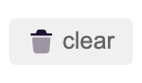

### clear all cookies in current domain

It's a dangarous operation. Make sure you do want to clear all cookie.

After clicking clear button, cookies which domain `equals` with current domain or is `father` of `current tab domain` will be removed.