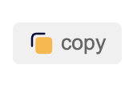

### copy all cookies in current domain into your clipboard



Click the copy button, it's all you need to do!

And cookie master will give you a feedback in right-bottom corner.
What's more, cookies in your clipboard is in standard data structure, like this:
```js
[{
	"domain": ".medium.com",
	"expirationDate": 1614503264.258181,
	"hostOnly": false,
	"httpOnly": true,
	"name": "__cfduid",
	"path": "/",
	"sameSite": "lax",
	"secure": false,
	"session": false,
	"storeId": "0",
	"value": "d3ecc1d77df97711b8b274f0fca2872dc1611911264"
}, {
	"domain": ".medium.com",
	"hostOnly": false,
	"httpOnly": true,
	"name": "__cfruid",
	"path": "/",
	"sameSite": "no_restriction",
	"secure": true,
	"session": true,
	"storeId": "0",
	"value": "c1414e196708c9ee39243071b5e1371d25421901-1611911265"
}]
```
After got the standard data, you can transfer/share the cookies to other domain/devices/people.  
What's more, this cookies can be used by other cookie plugins, as long as plugin deal data in standard structure.