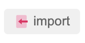

### import your clipboard cookies into current domain



It's a regular operation. Before clicking import button, make sure there is standrad structure cookies in your clipboard. Like this:

```js
[{
	"domain": ".medium.com",
	"expirationDate": 1614503264.258181,
	"hostOnly": false,
	"httpOnly": true,
	"name": "__cfduid",
	"path": "/",
	"sameSite": "lax",
	"secure": false,
	"session": false,
	"storeId": "0",
	"value": "d3ecc1d77df97711b8b274f0fca2872dc1611911264"
}, {
	"domain": ".medium.com",
	"hostOnly": false,
	"httpOnly": true,
	"name": "__cfruid",
	"path": "/",
	"sameSite": "no_restriction",
	"secure": true,
	"session": true,
	"storeId": "0",
	"value": "c1414e196708c9ee39243071b5e1371d25421901-1611911265"
}]
```

If there is incorrect data, cookie master will throw an error.